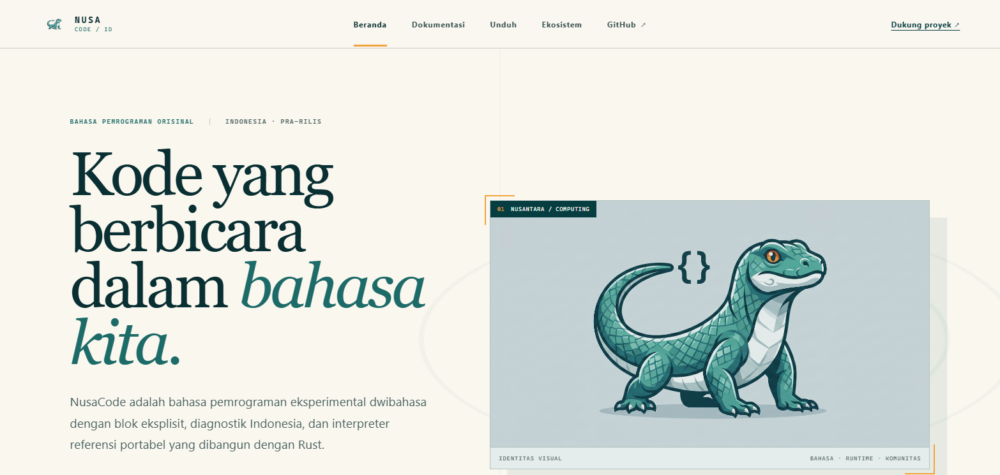

# NusaCode Website

Situs dokumentasi dan unduhan NusaCode, dibuat dengan React, TypeScript, dan Vite.

## Pratinjau

<p align="center">
  
</p>

Tampilan mengadaptasi warna teal, hijau laut, ivory, dan amber dari identitas
visual NusaCode, dengan layout responsif untuk desktop dan perangkat mobile.

## Menjalankan secara lokal

```bash
npm install
npm run dev
```

## Build produksi

```bash
npm run build
```

Hasil build tersedia di direktori `dist/`.

## Deployment

Workflow `.github/workflows/deploy.yml` membangun dan menerbitkan situs ke
GitHub Pages setiap push ke `main`. Aktifkan **Settings → Pages → Source: GitHub
Actions** pada repository `hairift/Web-App-NusaCode` satu kali.

Situs tidak memakai tracker, font eksternal, atau layanan gambar pihak ketiga.

## Lisensi

MIT. Lihat `LICENSE`.
